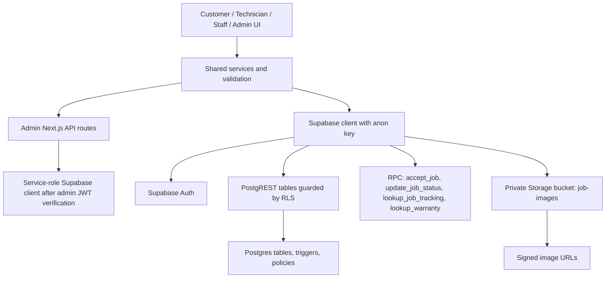
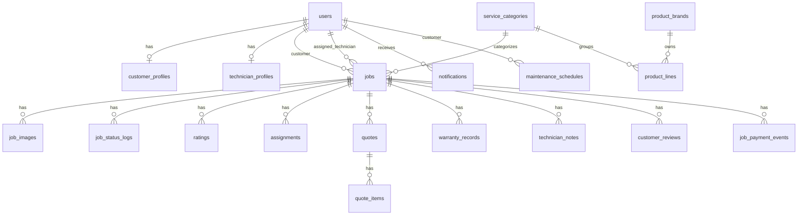
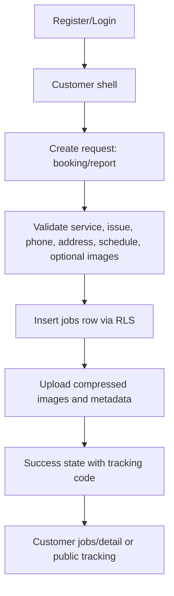
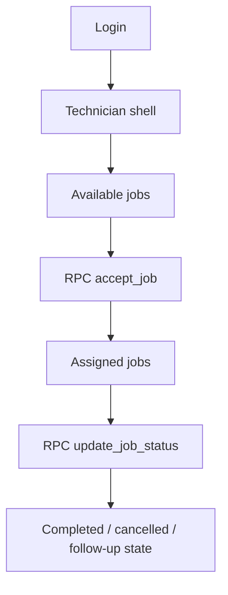

# Báo Cáo Phân Tích Kỹ Thuật Dự Án CNL Service Platform

Ngày lập: 2026-06-06  
Phạm vi: phân tích source code hiện có trong monorepo, không sửa code ứng dụng.  
Lưu ý bằng chứng: `docs/AI_RULES.md` không tồn tại trong repo tại thời điểm kiểm tra; `docs/AI_PROGRESS.md`, `README.md`, `docs/project-architecture.md`, `apps/*`, `packages/shared`, và `supabase/*` là nguồn chính.

## 1. Tổng Quan Dự Án

### Mục đích kinh doanh

CNL Service Platform là nền tảng điều phối dịch vụ kỹ thuật cho Châu Ngọc Long: khách hàng tạo yêu cầu lắp đặt/sửa chữa, kỹ thuật viên nhận và xử lý việc, admin/staff điều phối vận hành. README mô tả MVP là nền tảng kết nối khách hàng với kỹ thuật viên cho camera, Wi-Fi, internet networking và dịch vụ điện nhẹ (`README.md`).

### Đối tượng người dùng

| Nhóm | Vai trò trong code | Giao diện chính | Bằng chứng |
| --- | --- | --- | --- |
| Khách hàng thường/VIP | `customer`, `customer_vip` | `apps/web/app/customer`, public booking/report/track/warranty; mobile customer screen | `packages/shared/src/types.ts`, `apps/web/components/RoleGuard.tsx`, `apps/mobile/App.tsx` |
| Kỹ thuật viên thường/VIP | `technician`, `technician_vip` | `apps/web/app/technician`, mobile technician screen | `packages/shared/src/types.ts`, `apps/mobile/App.tsx` |
| Staff | `staff` | `apps/web/app/dashboard/staff` | `supabase/migrations/20260519100000_cnl_service_operations.sql`, `apps/web/app/dashboard/staff/page.tsx` |
| Admin | `admin` | `apps/admin` only | `docs/project-architecture.md`, `apps/admin/components/AdminGuard.tsx`, `apps/mobile/App.tsx` |

### Vấn đề được giải quyết

- Gom yêu cầu dịch vụ vào một luồng có mã theo dõi, ảnh hiện trạng, địa chỉ và Google Maps.
- Cho kỹ thuật viên xem việc có thể nhận, nhận việc, cập nhật trạng thái và xem ảnh.
- Cho admin quản lý job, khách hàng, kỹ thuật viên, thanh toán, báo cáo và dọn ảnh cũ.
- Cho khách hàng tra cứu tiến độ và bảo hành bằng mã + số điện thoại.

### MVP hiện tại

MVP web đã khá đầy đủ: public marketing/service pages, booking/report form nhiều bước, customer PWA, technician PWA, staff dashboard, admin operations console, Supabase RLS/RPC/schema, image upload/compression, manual image cleanup, PWA shell. Mobile tồn tại nhưng là shell nhỏ hơn, không đạt parity với web.

### Tầm nhìn cuối cùng suy ra từ code

Tầm nhìn trong code là hệ thống điều phối dịch vụ production-oriented gồm public acquisition, customer self-service, technician field workflow, staff/admin operations, thanh toán, bảo hành, báo cáo, PWA/offline UX và quản trị storage. Không thấy code cho thanh toán online, bản đồ realtime, push notification backend, quote UI đầy đủ hoặc mobile parity.

## 2. Công Nghệ Sử Dụng

| Nhóm | Công nghệ | Vai trò | Dùng ở đâu | Mức phụ thuộc |
| --- | --- | --- | --- | --- |
| Frontend web | Next.js 15, React 19 | Public/customer/technician web và admin | `apps/web/package.json`, `apps/admin/package.json` | Cao |
| UI | Tailwind CSS, lucide-react | Design system, icon, responsive UI | `apps/web/app/globals.css`, `apps/admin/app/globals.css`, components | Cao |
| Mobile | Expo 52, React Native 0.76 | Customer/technician mobile MVP | `apps/mobile/package.json`, `apps/mobile/App.tsx` | Trung bình |
| Backend | Supabase Postgres, RPC, RLS, Storage, Auth | Database, auth, authorization, storage, server functions | `supabase/migrations/*`, `packages/shared/src/services.ts` | Rất cao |
| Server API | Next.js route handlers | Admin-only service-role operations | `apps/admin/app/api/admin-users/route.ts`, `apps/admin/app/api/image-cleanup/route.ts` | Cao cho admin |
| Validation | Zod, shared TS validation | Admin API schema, customer form validation | `apps/admin/app/api/*`, `packages/shared/src/validation.ts` | Trung bình |
| State | React local state, in-memory cache, sessionStorage | UI state, server-state caching, auth profile cache | `apps/web/lib/cache.ts`, `apps/admin/lib/cache.ts`, auth providers | Cao |
| Storage | Supabase Storage private bucket | Job images + signed URLs | `supabase/migrations/20260518100000_phase_1_schema_auth_roles.sql`, `packages/shared/src/services.ts` | Cao |
| PWA | manifest, service worker, offline page, install prompt | Web/admin app-like shell | `apps/web/public/sw.js`, `apps/admin/public/sw.js`, `apps/web/hooks/usePwaInstallPrompt.ts` | Trung bình |
| Realtime | Supabase notifications table, no realtime channel usage found | Stored notifications and derived notifications | `notifications` table, `apps/web/lib/derivedNotifications.ts` | Thấp hiện tại |

## 3. Kiến Trúc Tổng Thể

```text
apps/web, apps/admin, apps/mobile
        |
        v
packages/shared
  types, constants, validation, services, image compression
        |
        v
Supabase Client / Next.js Admin API Routes
        |
        v
Supabase Auth + RPC + PostgREST + RLS
        |
        v
Postgres Tables + Supabase Storage
```



### Luồng request/response

- Web/mobile gọi shared services trong `packages/shared/src/services.ts`.
- Customer/technician/staff/admin client-side requests đi qua Supabase anon client và chịu RLS.
- Admin user management và image cleanup đi qua Next.js route handler, yêu cầu bearer token từ `supabase.auth.getSession()`, verify admin bằng `supabase.auth.getUser(token)` + bảng `users`, sau đó dùng service role.

### Luồng upload ảnh

1. Form kiểm tra số lượng/tệp bằng `validateUploadFiles`.
2. Browser nén ảnh bằng canvas, giới hạn cạnh lớn 1600px, ưu tiên WebP nếu hỗ trợ.
3. Upload vào Storage bucket `job-images` theo path `${userId}/${jobId}/...`.
4. Insert metadata vào `job_images`.
5. Gallery lấy metadata trước, signed URL sau để giảm blocking.

Bằng chứng: `packages/shared/src/images.ts`, `packages/shared/src/services.ts`, `apps/web/components/ServiceRequestForm.tsx`.

### Luồng xác thực

- Web/admin dùng Supabase browser client với anon key.
- Auth provider đọc profile từ `users`, cache profile trong `sessionStorage`, lắng nghe `onAuthStateChange`, có timeout/failsafe.
- Mobile dùng Supabase client với `AsyncStorage`, `autoRefreshToken` và `persistSession`.
- Không có middleware route-level trong source app; bảo vệ route là client-side guard + RLS database.

Bằng chứng: `packages/shared/src/supabase.ts`, `apps/web/components/AuthProvider.tsx`, `apps/admin/components/AuthProvider.tsx`, `apps/mobile/src/services/supabase.ts`.

### Luồng realtime

Không tìm thấy `channel(...)`, `postgres_changes`, hoặc Supabase realtime subscription trong app code. Notification hiện là table polling/cached fetch hoặc derived client-side từ jobs. Vì vậy realtime đúng nghĩa chưa được triển khai.

## 4. Cấu Trúc Source Code

| Thư mục | Mục đích | Thành phần chính |
| --- | --- | --- |
| `apps/web` | Next.js app cho public, customer, technician, staff | Public pages, customer shell, technician shell, staff dashboard, PWA lifecycle, shared UI primitives |
| `apps/admin` | Next.js app cho admin/manager | Admin shell, dashboard, jobs, reports, customers, technicians, image cleanup, admin APIs |
| `apps/mobile` | Expo mobile MVP | Auth screen, customer home, technician home, Supabase AsyncStorage services |
| `packages/shared` | Domain layer dùng chung | Types, constants, role helpers, validation, Supabase helper, services, image/time/maps helpers |
| `supabase/migrations` | Schema, RLS, functions, storage policies | Users/jobs/images/notifications/ratings, service catalog, warranty, payment, submitted time, cleanup |
| `supabase/functions` | Edge function placeholder | `cleanup-job-images` trả 410 vì auto cleanup bị tắt |
| `supabase/tests` | SQL permission checks | VIP technician visibility and accept-job checks |
| `docs` | Documentation/progress/design notes | Architecture, phase docs, progress, visual QA, this audit |

### apps/web modules

- Public: `/`, `/services`, `/booking`, `/report-issue`, `/track`, `/warranty`.
- Customer: `/customer`, `/customer/jobs`, `/customer/jobs/new`, `/customer/jobs/[id]`, `/customer/notifications`, `/customer/profile`.
- Technician: `/technician`, `/technician/jobs`, `/technician/map`, `/technician/notifications`, `/technician/profile`.
- Staff: `/dashboard/staff`.
- Admin bridge: `/dashboard/admin` explains admin runs in `apps/admin`.

### apps/admin modules

- `/login`: admin login.
- `/dashboard`: operations overview.
- `/jobs`: dispatch, detail panel, image gallery, assignment, status, payment.
- `/customers`, `/technicians`: shared account manager.
- `/reports`: KPI/report windows.
- `/image-cleanup`: manual storage cleanup UI.
- `/api/admin-users`: service-role user create/update/deactivate.
- `/api/image-cleanup`: service-role storage cleanup.

### packages/shared modules

- `types.ts`: domain types and DTO-like objects.
- `constants.ts`: role/status/service labels, upload limits, service catalog, contact data.
- `services.ts`: data access helpers and RPC wrappers.
- `validation.ts`: customer job/request validation.
- `images.ts`: client-side compression.
- `time.ts`: customer submitted time fallback.
- `roles.ts`: role predicate helpers.
- `maps.ts`: Google Maps URL helpers.

## 5. Database

### ERD tổng quan



### Bảng chính

| Bảng | Ý nghĩa | Khóa/constraint/index quan trọng | Bằng chứng |
| --- | --- | --- | --- |
| `users` | Profile app đồng bộ từ `auth.users` | PK/FK `auth.users(id)`, role enum, phone length, `users_role_idx` | `20260518100000_phase_1_schema_auth_roles.sql` |
| `customer_profiles` | Hồ sơ khách hàng | PK/FK `users`, self/admin policies | same |
| `technician_profiles` | Hồ sơ kỹ thuật viên | skills, availability, rating constraints | same |
| `jobs` | Yêu cầu dịch vụ | customer/assignee FK, status/priority, VIP, timestamps, tracking/service/payment/submitted columns, indexes by status/VIP/time/payment | phase 1 + later migrations |
| `job_images` | Metadata ảnh job | FK jobs/users, unique bucket/path, metadata, retention/manual cleanup flags | phase 1, image metadata, retention cleanup migrations |
| `job_status_logs` | Timeline trạng thái | FK job, index `(job_id, created_at desc)` | phase 1 |
| `ratings` | Đánh giá kỹ thuật viên cũ | score 1-5, unique job | phase 1 |
| `notifications` | Notification persisted | user FK, data jsonb, read_at, index user/read/time | phase 1 |
| `service_categories` | Danh mục dịch vụ public | unique slug, active/sort/order fields | `20260519100000_cnl_service_operations.sql` |
| `product_brands`, `product_lines` | Product catalog foundation | brand/category FKs | same |
| `assignments` | Lịch sử/metadata phân công | unique job/technician | same |
| `quotes`, `quote_items` | Báo giá foundation | quote status check, quote item totals | same |
| `warranty_records` | Bảo hành tra cứu | unique warranty_code, job/customer FK | same |
| `maintenance_schedules` | Lịch bảo trì foundation | status check | same |
| `technician_notes` | Ghi chú kỹ thuật viên | assigned technician insert policy | same |
| `customer_reviews` | Review mới | unique job/customer | same |
| `job_payment_events` | Audit thanh toán admin | admin-only RLS, index job/time | `20260525180000_job_payment_workflow.sql` |

### Functions/RPC

- `current_user_role`, `is_admin`, `is_customer`, `is_technician`, `is_vip_technician`, `is_staff`.
- `user_can_view_job` centralizes job visibility.
- `handle_new_auth_user` syncs auth user into `public.users`.
- `normalize_new_job` enforces customer ownership, pending status and VIP derived from owner role.
- `accept_job`, `assign_job_to_technician`, `update_job_status`, `update_job_payment_status`.
- `lookup_job_tracking`, `lookup_warranty` support public lookup by code + phone.

## 6. Nghiệp Vụ Chi Tiết

### Customer



Implemented on web: full progressive request flow, customer dashboard/jobs/detail, notifications, profile placeholder. Mobile: auth and customer home flow exists, but not full parity.

### Technician



Implemented on web: overview, job feed with tabs/sort, map list, notifications, profile placeholder, detail sheet, image lazy loading. RLS/RPC enforce VIP visibility and acceptance.

### Staff

Staff exists as web dispatch dashboard under `apps/web/app/dashboard/staff`. Database `is_staff()` treats staff and admin as staff-level viewers for jobs. Staff can inspect jobs/images/status via shared staff lib, but full account/payment admin remains in `apps/admin`.

### Admin

Admin can manage:

- Dashboard KPIs and recent operations.
- Jobs: filters, pagination, assignment, status, payment, timeline, image gallery.
- Customers/technicians: create/edit/VIP/lock via admin API.
- Reports: period KPIs/charts.
- Image cleanup: preview and manual deletion of old closed-job storage files.

## 7. Authentication & Authorization

### Authentication

- Supabase Auth is the identity provider.
- Web/admin tokens are managed by `@supabase/supabase-js` browser client storage behavior; profile cache is in `sessionStorage`, not token cache.
- Mobile explicitly persists Supabase auth session in `AsyncStorage`.
- Login/register use `signInWithPassword` and `signUp`.

### Authorization

- Client guards: `RoleGuard` for web customer/technician/staff, `AdminGuard` for admin.
- Database security boundary: RLS policies and RPC checks.
- No app-level Next middleware exists in source app. Protected pages render client guards, then redirect if profile is missing/disallowed.
- Admin service-role APIs re-check bearer token and active admin profile before service-role operations.

### Role rules

- Customers can own and create jobs.
- Technicians see pending unassigned jobs, with VIP restriction.
- VIP technicians see VIP + regular pending jobs.
- Staff/admin can view/manage jobs through `is_staff()`/`is_admin()`.
- Admin accounts are blocked from mobile and routed to admin web.

## 8. Bảo Mật

| Mục | Đã làm | Chưa làm / rủi ro | Mức rủi ro |
| --- | --- | --- | --- |
| Authentication | Supabase Auth, profile sync trigger, active-user profile checks | No server middleware on protected pages; initial guard is client-side until RLS applies | Medium |
| Authorization | RLS on domain tables, RPC role checks, admin API bearer verification | Any client bug may show transient protected shell before redirect, but data remains RLS-bound | Low/Medium |
| RLS | Broad policies for users/jobs/images/logs/ratings/notifications/catalog/warranty/payment events | Need ongoing tests beyond one SQL permission test | Medium |
| Storage policy | Private `job-images`, MIME and file-size bucket restrictions, path owner policy, signed URLs | Client accepts jpg/png/webp; bucket also allows HEIC but app validation rejects it | Low |
| Upload security | MIME validation, max 5 images/form, max 10MB, compression, private bucket | Client-side MIME can be spoofed; server relies on Supabase bucket MIME checks | Medium |
| XSS | React escapes strings; no dangerous HTML found in inspected app code | User-provided text displayed across UI; continue avoiding `dangerouslySetInnerHTML` | Low |
| CSRF | Mutations use bearer/session auth and Supabase client; admin APIs require Authorization header | No explicit CSRF token/rate limit on admin route handlers | Medium |
| Injection | Supabase query builder/RPC params used; Zod on admin APIs | Admin job search builds `.or()` string from keyword, should be reviewed for PostgREST filter escaping edge cases | Medium |
| Rate limit | None found in app/API route code | Public lookup and admin APIs have no explicit throttling | High |
| Sensitive data | Public job selects remove payment fields; service role only server-side | Admin APIs depend on `SUPABASE_SERVICE_ROLE_KEY`; deployment env must protect it | Medium |

## 9. Giao Diện

### Public web

| Screen | Chức năng | API/data | States |
| --- | --- | --- | --- |
| `/` | Home/service entry | `SERVICE_CATALOG`, `CNL_CONTACT` | Static polished cards |
| `/services` | Service catalog | shared constants | Static cards |
| `/booking` | Booking request | `ServiceRequestForm` -> create job/upload images | validation modal, offline message, submit/upload loading, success state |
| `/report-issue` | Report issue | same form in report mode | same |
| `/track` | Lookup job | RPC `lookup_job_tracking` | loading skeleton, empty, error/result |
| `/warranty` | Lookup warranty | RPC `lookup_warranty` | loading, empty, error/result |
| `/login` | Login/register | Supabase auth | loading/error, role redirect |

### Customer web

| Screen | Chức năng | API/data | States |
| --- | --- | --- | --- |
| `/customer` | Overview with active/recent requests | `fetchCustomerJobs` | skeleton, empty, error |
| `/customer/jobs` | Request list/search/status tabs | `fetchCustomerJobs` | skeleton, empty, error |
| `/customer/jobs/new` | Authenticated create request | `ServiceRequestForm` | same as public form |
| `/customer/jobs/[id]` | Detail, timeline, images | `jobs`, `job_images`, signed URLs | shell first, image lazy loading, skeleton |
| `/customer/notifications` | Derived visible notifications | `fetchVisibleNotifications` | skeleton, empty |
| `/customer/profile` | Profile/info placeholder | auth profile | static card |

### Technician web

| Screen | Chức năng | API/data | States |
| --- | --- | --- | --- |
| `/technician` | Overview of available/active/urgent jobs | available + assigned jobs | skeleton, empty, error |
| `/technician/jobs` | Available/assigned tabs, accept/status flow | `accept_job`, `update_job_status`, job images | skeleton, empty, confirm dialogs, toast/message |
| `/technician/map` | Assigned jobs with Google Maps links | assigned jobs | skeleton, empty, error |
| `/technician/notifications` | Derived notifications | available/assigned jobs | skeleton, empty |
| `/technician/profile` | Profile/info placeholder | auth profile | static card |

### Staff web

| Screen | Chức năng | API/data | States |
| --- | --- | --- | --- |
| `/dashboard/staff` | Dispatch list/detail/image gallery | staff job page lib, signed URLs | skeletons, empty, errors, lazy gallery |

### Admin web

| Screen | Chức năng | API/data | States |
| --- | --- | --- | --- |
| `/login` | Admin login | Supabase auth + profile role check | loading/error |
| `/dashboard` | KPI operations center | `fetchAdminDataset` | preserved-data refresh, errors |
| `/jobs` | Job operations console | `fetchAdminJobsPage`, RPC assignment/status/payment, image detail | skeletons, stale-request guard, dialogs, empty/error |
| `/customers` | Account manager | admin dataset + admin API | loading, search/filter/table/mobile cards/dialogs |
| `/technicians` | Account manager | same manager | same |
| `/reports` | Reporting dashboard | admin dataset | period filters, charts, skeleton/error |
| `/image-cleanup` | Manual storage cleanup | admin image cleanup API | preview, confirmation, result/error |

## 10. Quản Lý State

- Không thấy Zustand hoặc React Query trong dependencies.
- State chủ yếu là React local state (`useState`, `useEffect`, `useMemo`) ở page/component level.
- Server state được cache bằng custom in-memory `Map` trong `apps/web/lib/cache.ts` và `apps/admin/lib/cache.ts`.
- Auth profile cache dùng `sessionStorage` trong web/admin auth providers.
- Invalidations theo prefix sau mutations: `invalidateCache("admin:")`, `invalidateCache("technician:")`, `invalidateCache("notifications:")`, customer job cache priming.
- No cross-tab sync found.

## 11. Realtime

| Hạng mục | Hiện trạng |
| --- | --- |
| Notifications table | Có bảng và CRUD helpers. RPC status/accept inserts notifications. |
| Derived notifications | Web customer/technician currently derives visible notifications from jobs in `apps/web/lib/derivedNotifications.ts`. |
| Realtime channel | Không tìm thấy Supabase `channel`/`postgres_changes` subscription. |
| Job updates realtime | Chưa realtime; UI refresh/fetch/cache. |
| Chi phí vận hành | Hiện thấp vì không mở realtime subscriptions; đổi lại UX không tự động cập nhật tức thì. |

## 12. Hiệu Năng

### Frontend

- PWA service workers cache static assets and public shell routes.
- Route prefetch on nav hover/focus.
- Skeleton loading instead of blocking blank states in many screens.
- Existing data remains visible while refetching in admin/staff/job flows.
- Client-side image compression reduces upload size.
- Image gallery resolves signed URLs lazily and caches signed URL results in memory.
- In-memory data cache avoids repeated fetches within short TTLs.

### API/network

- Supabase queries use server-side filtering/pagination in admin jobs.
- Admin job detail fetches images/status/payment events in parallel.
- Admin list loads related users and image counts only for current page.
- Public tracking/warranty use RPC when available, with fallback.

### Database

- Indexes exist for jobs status/customer/assignee/VIP/created, status+VIP+created, service category, schedule, payment, image job/time, notifications user/read/time.
- Missing explicit index on `jobs.customer_submitted_at` despite ordering/filtering by it in admin jobs. Current code orders/filters by this column.

### Storage

- Private bucket; signed URL TTL 15 minutes; signed URL cache has safety margin.
- Manual cleanup avoids automatic deletion and keeps metadata/audit flags.

## 13. PWA

### Web PWA

- Manifest configured in layout.
- Service worker caches static assets and public shell routes.
- Supabase/auth/storage/rest requests are excluded from SW caching.
- Private routes use network with offline fallback, not cached shell.
- Local/LAN hosts unregister SW and clear caches to prevent dev cache issues.
- Install prompt hook exists.
- Offline UI exists for form submit and lifecycle banners.

### Admin PWA

- Manifest and service worker configured.
- Static asset cache only; navigation falls back to offline page.
- Supabase requests excluded.
- Offline banner warns admin cannot update jobs/accounts/images while offline.

### Thiếu

- No push subscription backend found.
- No background sync queue for offline job submissions/uploads.
- Mobile Expo app is not documented as having native push/offline sync.

## 14. Tính Năng Đã Hoàn Thành

| Tính năng | Trạng thái | Mức hoàn thiện |
| --- | --- | --- |
| Supabase schema/RLS/Auth roles | Done | Cao |
| Customer registration/login | Done | Cao trên web, cơ bản trên mobile |
| Admin login/guard | Done | Cao |
| Public service pages | Done | Cao |
| Booking/report request | Done | Cao |
| Image upload/compression | Done | Cao |
| Customer tracking lookup | Done | Trung/Cao |
| Warranty lookup | Done | Trung |
| Customer dashboard/jobs/detail | Done | Cao trên web |
| Technician available/assigned jobs | Done | Cao trên web, cơ bản trên mobile |
| Technician accept/status update | Done | Cao |
| Staff dispatch dashboard | Done | Trung/Cao |
| Admin dashboard | Done | Cao |
| Admin job assignment/status/payment | Done | Cao |
| Admin customers/technicians management | Done | Cao |
| Admin reports | Done | Trung/Cao |
| Manual image cleanup | Done | Cao |
| PWA shell/offline fallback | Done | Trung/Cao |
| Notifications | Partial | Table + derived/cached UI, no realtime/push backend |
| Mobile app | Partial | Shell/MVP, not feature parity |
| Quotes/maintenance/reviews UI | Partial/DB-only | Schema foundation exists, UI usage limited or absent |

## 15. Tính Năng Còn Thiếu Theo Code Hiện Tại

- Realtime job/notification updates are not implemented.
- Push notifications do not have backend subscription storage or delivery flow.
- Mobile app does not match web feature depth for booking/report, detail, map, notifications, profile, image upload.
- Quote, quote item, maintenance schedule, technician notes and customer review schemas exist, but full product UI is not evident in inspected app surfaces.
- No rate limiting for public lookup or admin API route handlers.
- No server middleware route protection for Next.js pages; guards are client-side plus RLS.
- No explicit `customer_submitted_at` database index found.
- No production deployment/hosting config found beyond app/package scripts and PWA assets.
- `docs/AI_RULES.md` is referenced by project workflow instructions but missing from repo.

## 16. Nợ Kỹ Thuật

| Mức | Nợ/Rủi ro | Bằng chứng | Tác động |
| --- | --- | --- | --- |
| High | No explicit rate limiting on public lookup/admin APIs | `apps/web/app/track`, `apps/web/app/warranty`, `apps/admin/app/api/*` | Abuse/bruteforce risk |
| High | No realtime despite product scope mentioning notifications/job updates | no `channel`/`postgres_changes` matches | Users need manual refresh/cache windows |
| Medium | Client-side route guards only | no app middleware found; guards in components | Brief UX exposure risk; RLS still protects data |
| Medium | Missing `jobs.customer_submitted_at` index while admin filters/orders by it | admin query uses column; migrations set default but no index found | Query cost grows with jobs |
| Medium | Mobile app is behind web | `apps/mobile/App.tsx` and mobile services are simple shell | Product parity risk |
| Medium | Some DB foundations are not surfaced | quotes/maintenance/notes/reviews tables exist | Scope ambiguity and unused schema |
| Medium | Admin search builds PostgREST `.or()` string from raw keyword | `apps/admin/lib/admin.ts` | Filter escaping edge-case risk |
| Low | Encoding/mojibake appears in some existing docs/output strings when read by PowerShell | current file outputs | Documentation/readability issue, not runtime confirmed |
| Low | Duplicate web/admin cache/auth patterns | `apps/web/lib/cache.ts`, `apps/admin/lib/cache.ts`, auth providers | Maintenance overhead |

## 17. Đánh Giá Tổng Thể

| Hạng mục | Điểm | Nhận xét |
| --- | --- | --- |
| Kiến trúc | 8/10 | Monorepo rõ, shared domain tốt, Supabase centralizes security. |
| Bảo mật | 7/10 | RLS/RPC mạnh, admin service-role được verify; thiếu rate limit/middleware. |
| UX | 8/10 | Web/PWA flows có loading/empty/error, mobile-first nhiều nơi. |
| UI | 8/10 | Design system tương đối nhất quán, admin dense operations khá tốt. |
| Hiệu năng | 7.5/10 | Có cache/lazy/signed URL optimization; cần index submitted time và realtime strategy nếu scale. |
| Khả năng mở rộng | 7.5/10 | Schema mở rộng tốt; mobile/realtime/unused foundations cần hoàn thiện. |
| Chất lượng code | 7.5/10 | TypeScript/shared services tốt; local state nhiều nhưng phù hợp quy mô hiện tại. |
| Triển khai thực tế | 7/10 | Có PWA/build scripts/Supabase migrations; thiếu deployment/rate-limit/monitoring evidence. |

### Kết luận

1. Dự án đang ở giai đoạn MVP nâng cao / pre-production: web và admin đủ rộng để vận hành thử nội bộ, mobile còn MVP.
2. Có thể chạy thực tế có kiểm soát nếu Supabase migrations/env/deployment đã đúng và team chấp nhận thiếu realtime/push/rate-limit.
3. Để production-ready hơn cần tập trung vào rate limiting, monitoring/deployment hardening, submitted-time index, realtime/push decision, mobile parity hoặc tuyên bố mobile là secondary.
4. Điểm mạnh lớn nhất: Supabase RLS/RPC làm security boundary rõ; web/admin UX đã nhiều trạng thái; image upload/storage cleanup được xử lý cẩn thận.
5. Điểm yếu lớn nhất: realtime/push chưa có, mobile chưa parity, public/admin APIs thiếu rate limit, một số schema foundation chưa được product hóa.
